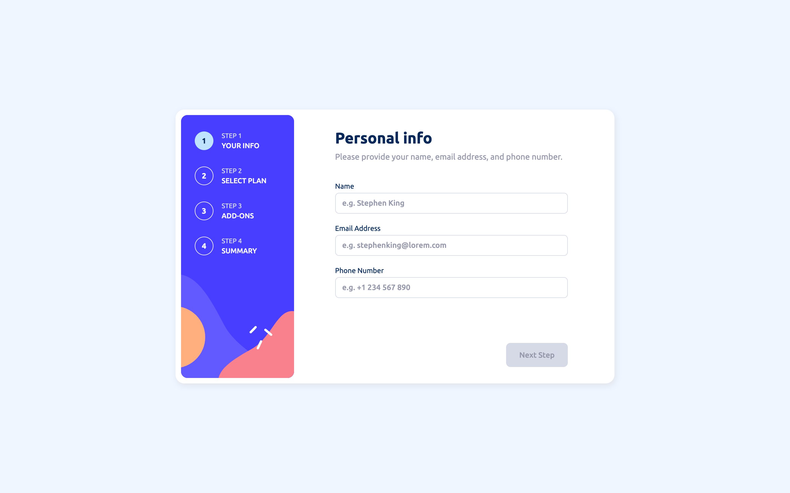
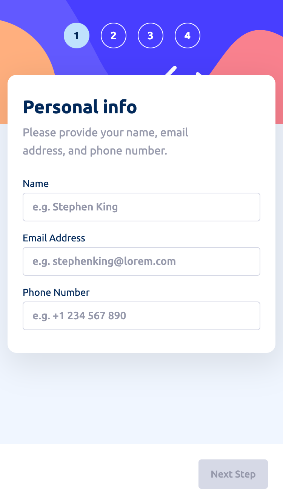

# Multi-Step Form

This is a solution to the [Multi-step form challenge on Frontend Mentor](https://www.frontendmentor.io/challenges/multistep-form-YVAnSdqQBJ).

## Table of contents

- [Overview](#overview)
  - [The challenge](#the-challenge)
  - [Screenshots](#screenshots)
  - [Links](#links)
- [My process](#my-process)
  - [Built with](#built-with)
  - [What I learned](#what-i-learned)
  - [Useful resources](#useful-resources)
- [Author](#author)

## Overview

### The challenge

Users should be able to:

- Complete each step of the sequence
- Go back to a previous step to update their selections
- See a summary of their selections on the final step and confirm their order
- View the optimal layout for the interface depending on their device's screen size
- See hover and focus states for all interactive elements on the page
- Receive form validation messages if:
  - A field has been missed
  - The email address is not formatted correctly
  - A step is submitted, but no selection has been made

### Screenshots

#### Desktop:



#### Phone:



### Links

- Solution URL: [Add solution URL here](https://github.com/hanna-skryl/multi-step-form.git)
- Live Site URL: [Add live site URL here](https://hanna-skryl.github.com/multi-step-form)

## My process

### Built with

- Semantic HTML5 markup
- CSS custom properties
- Mobile-first workflow
- [Angular](https://angular.io/) - JS framework

### What I learned

This chanllenge gave me an opportunity to try out the latest Angular features:

- Strictly typed reactive forms

```ts
type MultiStepForm = {
  info: FormGroup<InfoGroup>;
  plan: FormGroup<PlanGroup>;
  addOns: FormGroup<AddOnsGroup>;
};
```

- Angular Signals

  - inputs
  - outputs
  - model inputs
  - view queries

### Useful resources

- [Strongly Typed Reactive Forms in Angular](https://angularindepth.com/posts/1527/strongly-typed-reactive-forms-in-angular) - This is an amazing article that inspired me to start experimenting with strictly typed reactive forms in the first place and led me to take up this challenge.
- [Component Communication with Signals: Inputs, Two-Way Bindings, and Content/ View Queries](https://www.angulararchitects.io/blog/component-communication-with-signals-inputs-two-way-bindings-and-content-view-queries/) - This guide was extremely helpful in understanding how to handle Signal-based property bindings. I highly recommend it to anyone still learning this concept.

## Author

- GitHub - [Hanna Skryl](https://github.com/hanna-skryl)
- Frontend Mentor - [@hanna-skryl](https://www.frontendmentor.io/profile/hanna-skryl)
- Twitter - [@hanna_skryl](https://twitter.com/hanna_skryl)
